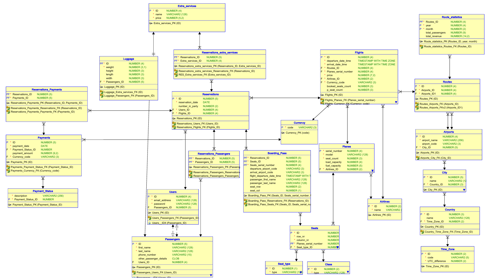

# Temat projektu: System obsługi linii lotniczych
## Modele bazy danych
### Model pojęciowy
Opis encji:
**TO DO**
 

### Model relacyjny

Zastosowana denormalizacja:
- Kolumny wyliczane
1. Tabela Payments - dodanie kolumny `payment_amount` 
Odpowiada za wyliczenie całkowitej ceny rezerwacji wraz z dodanymi usługami dodatkowymi.
- Pre-join kluczy obcych
1. Tabela Payments - dodanie klucza obcego do tabeli Currency 
Ma na celu przyspieszyć wyświetlanie kwoty transakcji wraz z odpowiednią walutą.
2. Tabela Flights - dodanie klucza obcego do tabeli Airlines 
Pomocne, ponieważ przy locie chcemy od razu wyświetlić też informację o linii lotniczej.
- Pre-join atrybutów
1. Tabela Boarding Pass - duplikowane atrybuty: `departure_airport_code, arrival_airport_code, flight_departure_time, passenger_first_name, passenger_last_name, seat_row, seat_col` 
Odpowiada temu, że chcemy, aby karta pokładowa była niezmienna w czasie. Dane kart pokładowych są szybkiej wyświetlane i mamy informację o stanie danych z przeszłości, ponieważ w tym przypadku taki nas interesuje.
2. Tabela Flights - pre-join atrybutu `seat_count` z tabeli Planes 
Utworzone, żeby przyspieszyć porównywanie z kolumną `booked_seats`.
- Kolumny agregujące
1. Tabela Flights - dodana kolumna `booked_seats` 
Pomocna do częstego odczytywania stopnia zapełnienia lotu - może być to przydatne, żeby nie doprowadzić do przepełnienia lotu.
- Tabele agregujące
1. Dodana tabela `Route_statistics` 
Pozwala zagregować statystyki dotyczące ilości klientów i całkowitych przychodów z tras dla konkretnych lat oraz miesięcy. Przyjęta konwencja: dla year=0, month=0 zapisywana jest suma całkowita i dla month=0 - suma roczna.

 

