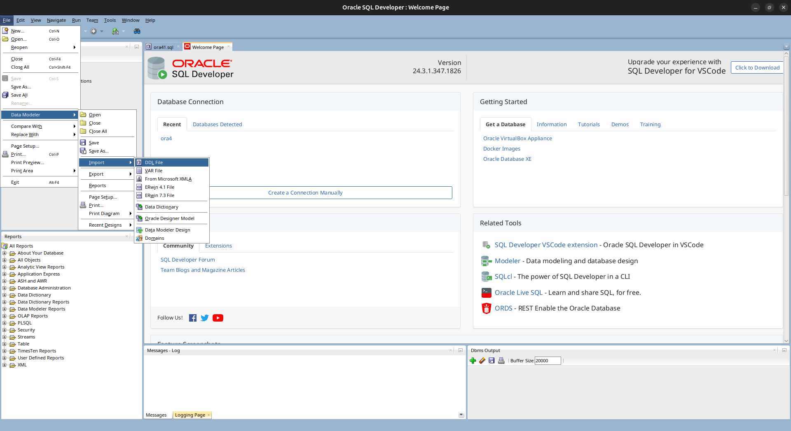
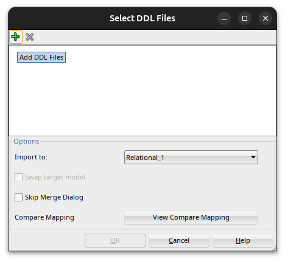
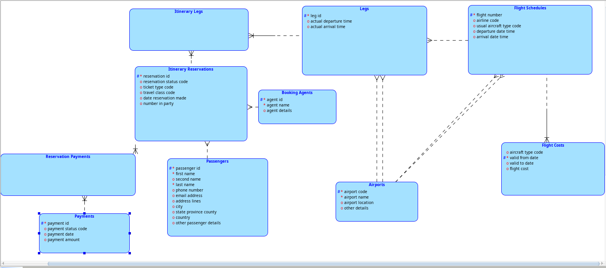

# Temat projektu: System obsługi linii lotniczych
## Modele bazy danych
### Model pojęciowy
Opis encji:
**TO DO**
 

### Model relacyjny
Zastosowana denormalizacja:
**TO DO**
 

## 🛠️ Kroki Importu Schematu (DDL) z SQL

### 1. Inicjacja Importu pliku SQL
Aby rozpocząć pracę z istniejącym skryptem SQL, należy użyć modułu Data Modeler.
* Wybierz: **File** -> **Data Modeler** -> **Import** -> **DDL File**.

### 2. Wybór plików źródłowych
W oknie **Select DDL Files** dodaj swój wygenerowany wcześniej plik `.sql`

---

## 📊 Modelowanie w Data Modeler

### 3. Generowanie Diagramu Relacyjnego
Po pomyślnym imporcie i wykonaniu operacji **Merge**, program wygeneruje graficzną reprezentację tabel, kolumn oraz relacji (kluczy obcych).

### 4. Inżynieria Wsteczna do Modelu Logicznego
Aby przejść na wyższy poziom abstrakcji (Model Pojęciowy), należy przekształcić model relacyjny w logiczny.
* Kliknij ikonę **Engineer to Logical Model** (niebieskie strzałki na pasku narzędzi).

